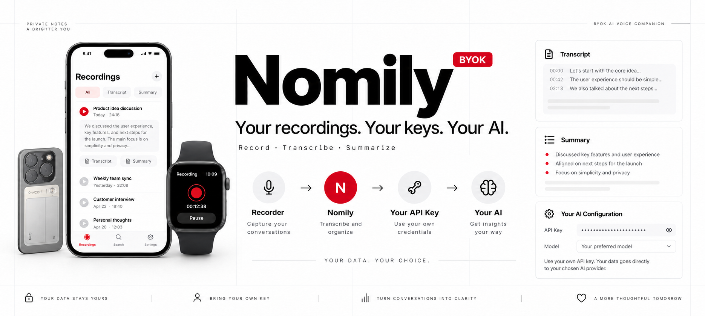
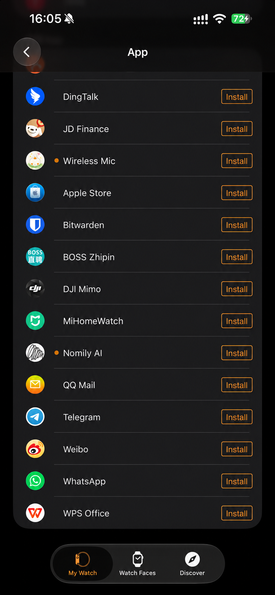
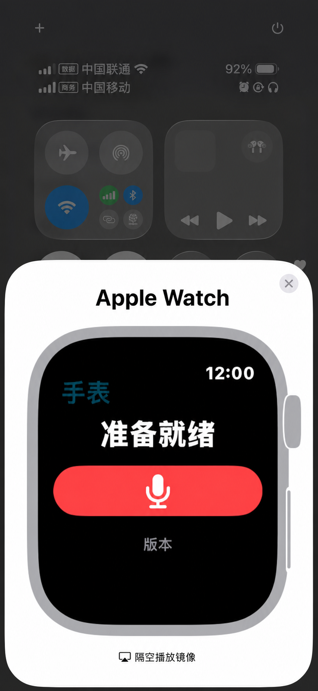
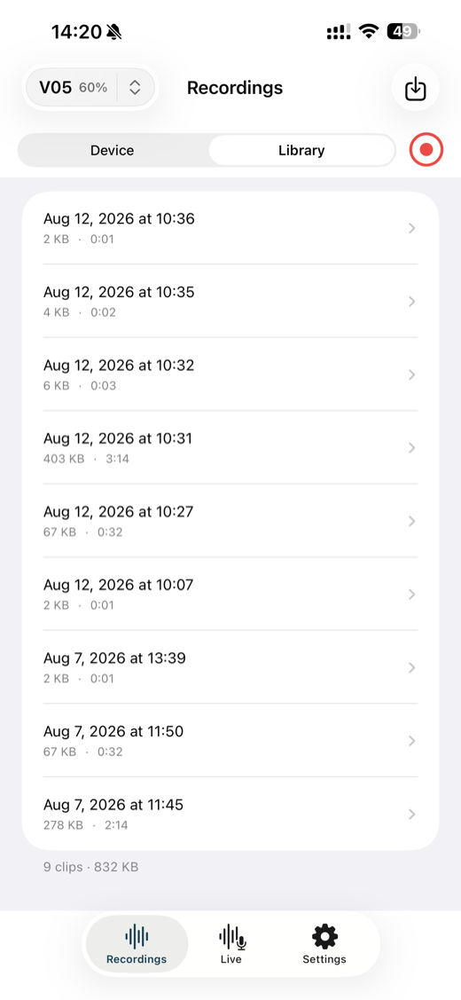
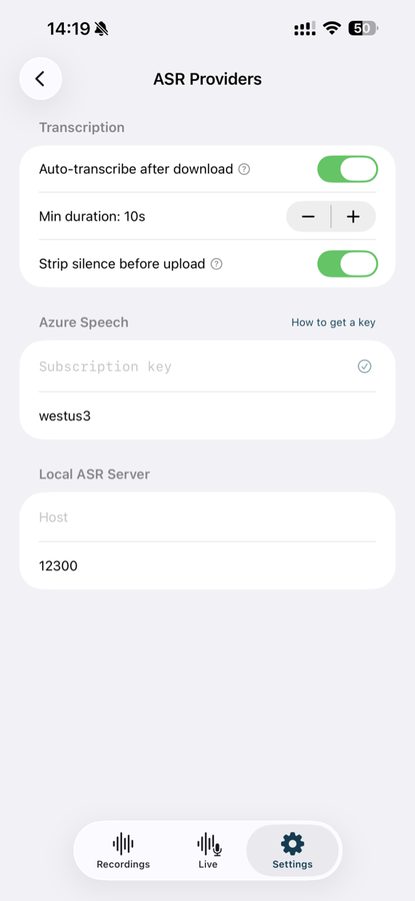
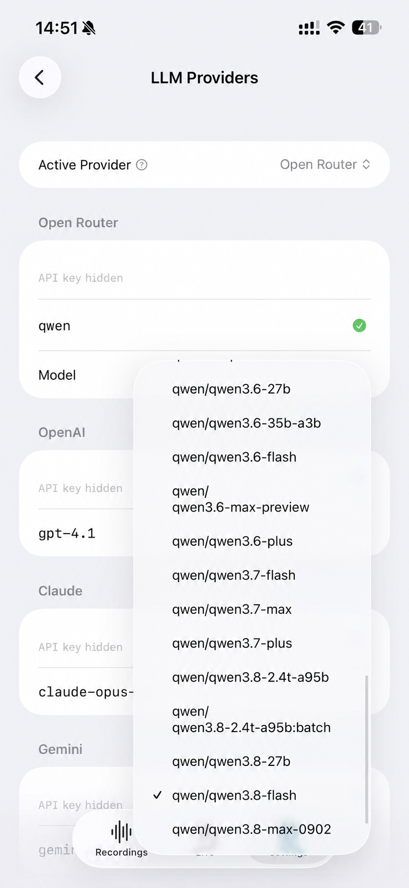

# Nomily

> **Recorder → Nomily → Your API Key → Your AI**

<p align="center">
  
</p>

**BYOK voice-recording companion for V05E, Apple Watch, and iPhone imports —
ASR transcription, speaker diarization, AI summaries, and local ASR endpoint
support.**

Nomily brings recordings into a native client, transcribes them with a provider
you configure, and generates a summary with an AI provider you choose.

This repository is the project entry point. The runnable native clients live in
[`nomily-ios`](https://github.com/Nomily-Ai/nomily-ios) and
[`nomily-android`](https://github.com/Nomily-Ai/nomily-android).

## What is Nomily?

Nomily is not a hosted transcription account or a shared recording cloud. It is
a native companion workflow for recordings and user-configured AI services. The
app keeps the choice of transcription and summary provider with the user.

The public repositories provide source for inspection and local builds. A source
commit is not a promise of store availability, device/firmware compatibility, or
a production service release.

## What it does today

- Connects to the V05E BLE recorder workflow, downloads recordings, and manages
  a local recordings library.
- Imports recordings on iPhone, including recordings transferred from the Apple
  Watch companion.
- Transcribes live or recorded audio through Azure Speech or a user-operated
  local faster-whisper-compatible ASR endpoint; Azure transcription enables
  speaker diarization for up to 10 speakers.
- Generates summaries, titles, and translations with a configured LLM provider:
  OpenAI, Anthropic, Gemini, OpenRouter, Ollama, or a custom OpenAI-compatible
  endpoint.
- Provides native iOS / Apple Watch and Android implementations rather than a
  cross-platform wrapper.

## Privacy and provider boundaries

Nomily is not a hosted transcription account or a shared recording cloud. API
keys are supplied by the user and must never be committed. Keep recordings,
transcripts, device identifiers, logs, generated configuration files, and access
credentials out of issues and pull requests.

| Service layer | Data sent in a configured workflow | Who provides it |
|---|---|---|
| Nomily client | Recording library, transfer state, and generated files on the client | You install and operate the client. |
| Azure Speech | Audio for transcription, when Azure is selected | Your Azure account and key. |
| Local ASR endpoint | Audio for transcription, when a local endpoint is selected | You operate the endpoint. |
| LLM provider | Transcript text needed for summary, title, or translation | Your selected provider, model, endpoint, and key. |

The public repositories do not include a shared Nomily cloud, a bundled provider
account, or a complete self-hosted sync stack. Local ASR and Ollama are
provider integrations, not a claim that every product layer is self-hosted.

## How it works

```text
V05E recorder / Apple Watch / audio imported on iPhone
                  │
                  ▼
        Nomily native client
  local library · transfer · playback
                  │
        ┌─────────┴──────────┐
        ▼                    ▼
Azure Speech or        Your LLM provider
local ASR endpoint     summary · title · translation
diarization when       OpenAI · Anthropic · Gemini
Azure is selected      OpenRouter · Ollama · compatible endpoint
        │                    │
        └─────────┬──────────┘
                  ▼
         Transcript and summary
```

## Recording input support

| Input | Current source status | Notes |
|---|---|---|
| V05E recorder | Implemented in both clients | Primary BLE recording input; compatibility still depends on the actual device and firmware under test. |
| Audio imported on iPhone | Implemented in `nomily-ios` | iPhone is an import, management, transcription, and summary client. |
| Apple Watch microphone | Implemented in `nomily-ios` | A paired Watch companion transfers recordings to iPhone. |
| Other recorder models | Not committed | A model is not supported merely because it can record audio. |
| Android Watch companion | Not published | Do not infer a Wear OS client from the Android app source. |

## Apple Watch companion

After Nomily AI is installed on the paired iPhone, install its Watch companion:

1. Open the **Watch** app on iPhone and scroll to **Available Apps**.
2. Find **Nomily AI** and tap **Install**.
3. Open Nomily AI on Apple Watch and record when V05E is not with you. The
   recording syncs to the iPhone Nomily AI app for transcription, organization,
   and summaries.

| Install on Apple Watch | Record on Apple Watch |
|---|---|
|  |  |

### Planned or not published

| Item | Status |
|---|---|
| Other recorder models and protocols | Compatibility is not committed until tested with the relevant firmware. |
| Android Watch companion | Not published. |
| RAG, MCP, shared self-hosted sync | Not represented by the current public client source; not an announced capability. |
| Online no-key demo | Planned for the public site; not linked from this repository yet. |

## Repository map

| Repository | Role | Relationship |
|---|---|---|
| **nomily-app** | Project entry, cross-project documentation, licence, and preview assets | Start here. It does not contain an installable client by itself. |
| [`nomily-ios`](https://github.com/Nomily-Ai/nomily-ios) | SwiftUI client for iPhone and Apple Watch | Its own native project, build instructions, and issue tracker. |
| [`nomily-android`](https://github.com/Nomily-Ai/nomily-android) | Kotlin / Jetpack Compose client for Android | Its own native project, build instructions, and issue tracker. |
| `nomily-site` | Private static-site deployment source | Hosts setup and demo material; it is not a mobile-client source repository. |

## Build and project layout

The clients share product concepts and protocol expectations, but are separate
native implementations. Review the relevant repository before choosing a build
path:

```text
nomily-app/       project map, licence, public preview assets
nomily-ios/       iOS app, Watch companion, BLE / ASR / local library modules
nomily-android/   Android app and core protocol, crypto, audio, ASR, LLM modules
nomily-site/      private static deployment source for guides and the demo
```

| Goal | Start here |
|---|---|
| Build for iPhone or Apple Watch | [`nomily-ios`](https://github.com/Nomily-Ai/nomily-ios) — macOS, Xcode 15+, and a physical iPhone; Apple Watch optional. |
| Build for Android | [`nomily-android`](https://github.com/Nomily-Ai/nomily-android) — JDK 21, Android Studio or Gradle, and a physical Android phone. |
| Report a defect | Open an issue in the affected native-client repository with redacted reproduction steps. |
| Review terms | Read the [Nomily Small Team License](LICENSE). |

## App preview

| Recordings | Transcription providers | LLM providers for summaries |
|---|---|---|
|  |  |  |

Screens use synthetic or non-sensitive preview data. Review
[`media/README.md`](media/README.md) before reusing product imagery or brand
assets.

## Licence

The source is available under the [Nomily Small Team License 1.0.0](LICENSE).
It permits personal use and company use by teams of up to 10 people; larger
teams need a separate paid licence. Contact <nomily@geekis.com> for commercial
licensing. This is a source-available licence, not an OSI-approved open-source
licence.

Brand assets under [`media/`](media/) are excluded from that licence; see
[`media/README.md`](media/README.md).
