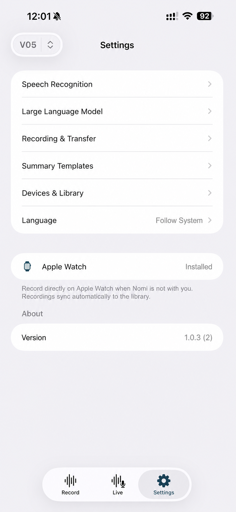

# Nomily

> **录音设备 → Nomily → 你的 API Key → 你的 AI**

<p align="center">
  
</p>

<p align="center">
  <a href="https://github.com/Nomily-Ai/nomily-ios"></a>
  <a href="https://github.com/Nomily-Ai/nomily-android"></a>
  <a href="https://geekis.com"></a>
  <a href="LICENSE"></a>
</p>

<p align="center">
  <a href="README.md">English</a> · <a href="README.zh-CN.md">简体中文</a> · <a href="README.zh-TW.md">繁體中文</a>
</p>

**面向 V05E、Apple Watch 与 iPhone 导入音频的 BYOK 录音伴侣：支持 ASR 转录、说话人分离、AI 摘要与本地 ASR 端点。**

Nomily 将录音带入原生客户端，使用你配置的服务商转录，并通过你选择的 AI 服务商生成摘要。

这是项目入口仓库；可运行的原生客户端位于
[`nomily-ios`](https://github.com/Nomily-Ai/nomily-ios) 与
[`nomily-android`](https://github.com/Nomily-Ai/nomily-android)。

## 快速链接

| 🌐 在线演示 | 🎥 演示视频 | 𝕏 动态 | 📚 文档 |
|---|---|---|---|
| [体验固定示例预览](https://geekis.com/demo/) | [Nomily YouTube Shorts](https://www.youtube.com/@Nomily-Ai/shorts) | [@nomilyai](https://x.com/nomilyai) | [Geekis.com](https://geekis.com) |

## Nomily 是什么？

Nomily 不是托管的转录账户或共享录音云，而是面向录音与用户自选 AI 服务的原生配套工作流。转录与摘要服务商由用户选择。

公开仓库提供源码审阅与本地构建。源码提交并不代表应用商店可用、设备/固件兼容，或生产服务已经发布。

## 当前可以做什么

- 连接 V05E BLE 录音器工作流、下载录音并管理本地录音库。
- 在 iPhone 导入录音，包括 Apple Watch 伴侣传回的录音。
- 通过 Azure Speech 或由用户运营的 local faster-whisper-compatible ASR 端点转录实时或已录制音频；Azure 转录支持最多 10 位说话人分离。
- 通过已配置的 LLM 服务商生成摘要、标题和翻译：OpenAI、Anthropic、Gemini、OpenRouter、Ollama 或自定义 OpenAI-compatible endpoint。
- 提供原生 iOS / Apple Watch 与 Android 实现，而非跨平台套壳。

## 隐私与服务商边界

Nomily 不是托管转录账户或共享录音云。API Key 由用户提供，绝不可提交到仓库。请勿在 Issue 或 Pull Request 中提交录音、转录文本、设备标识、日志、生成配置或访问凭据。

| 服务层 | 已配置工作流中发送的数据 | 由谁提供 |
|---|---|---|
| Nomily 客户端 | 客户端上的录音库、传输状态与生成文件 | 由你安装和运行客户端。 |
| Azure Speech | 选择 Azure 时用于转录的音频 | 你的 Azure 账户与 Key。 |
| 本地 ASR 端点 | 选择本地端点时用于转录的音频 | 由你运行该端点。 |
| LLM 服务商 | 用于摘要、标题或翻译所需的转录文本 | 你选择的服务商、模型、端点与 Key。 |

公开仓库不包含共享 Nomily 云、内置服务商账户或完整自托管同步栈。本地 ASR 与 Ollama 是服务商集成，不代表整个产品均可自托管。

## 工作流程

```text
V05E 录音器 / Apple Watch / iPhone 导入音频
                  │
                  ▼
          Nomily 原生客户端
   本地录音库 · 传输 · 播放
                  │
        ┌─────────┴──────────┐
        ▼                    ▼
Azure Speech 或         你的 LLM 服务商
本地 ASR 端点            摘要 · 标题 · 翻译
选择 Azure 时支持         OpenAI · Anthropic · Gemini
说话人分离                OpenRouter · Ollama · 兼容端点
        │                    │
        └─────────┬──────────┘
                  ▼
             转录文本与摘要
```

## 录音输入支持

| 输入来源 | 当前源码状态 | 说明 |
|---|---|---|
| V05E 录音器 | 两个客户端均已实现 | 主要 BLE 录音输入；兼容性仍取决于实际测试设备和固件。 |
| iPhone 导入音频 | `nomily-ios` 已实现 | iPhone 是导入、管理、转录与摘要客户端。 |
| Apple Watch 麦克风 | `nomily-ios` 已实现 | 已配对的 Watch 伴侣将录音传回 iPhone。 |
| 其他录音器型号 | 未承诺 | 可以录音不等于已被支持。 |
| Android Watch 伴侣 | 未发布 | 不应从 Android App 源码推断 Wear OS 客户端。 |

## Apple Watch 伴侣

在配对 iPhone 安装 Nomily AI 后，按以下方式安装 Watch 伴侣：

1. 打开 iPhone 的 **Watch** App，并滚动到 **可用 App**。
2. 找到 **Nomily AI**，点击 **安装**。
3. 在 iPhone 的 Nomily AI 内打开 **Settings → Apple Watch**，确认显示 **Installed**。
4. 未携带 V05E 时，在 Apple Watch 打开 Nomily AI 录音；录音会同步回 iPhone 的 Nomily AI，用于转录、整理和摘要。

| 从 Watch App 安装 | 在 Nomily 设置中确认 | 在 Apple Watch 录音 |
|---|---|---|
|  |  |  |

### 计划中或未发布

| 项目 | 状态 |
|---|---|
| 其他录音器型号与协议 | 仅在相关固件完成测试后才会确认兼容性。 |
| Android Watch 伴侣 | 未发布。 |
| RAG、MCP、共享自托管同步 | 当前公开客户端源码未体现，尚非已宣布能力。 |
| 无需 Key 的在线演示 | 计划在公开网站提供；临时入口为 [Geekis.com](https://geekis.com)。 |

## 仓库关系

| 仓库 | 角色 | 关系 |
|---|---|---|
| **nomily-app** | 项目入口、跨项目文档、许可与预览素材 | 从这里开始；本仓库本身不包含可安装客户端。 |
| [`nomily-ios`](https://github.com/Nomily-Ai/nomily-ios) | iPhone 与 Apple Watch 的 SwiftUI 客户端 | 有独立原生工程、构建说明与 Issue 追踪。 |
| [`nomily-android`](https://github.com/Nomily-Ai/nomily-android) | Android Kotlin / Jetpack Compose 客户端 | 有独立原生工程、构建说明与 Issue 追踪。 |
| `nomily-site` | 私有静态站点部署源码 | 承载设置和演示材料；不是移动客户端源码仓库。 |

## 构建与项目结构

客户端共享产品概念与协议预期，但属于独立的原生实现。选择构建路径前，请先阅读对应仓库：

```text
nomily-app/       项目说明、许可、公开预览素材
nomily-ios/       iOS App、Watch 伴侣、BLE / ASR / 本地录音库模块
nomily-android/   Android App，以及协议、加密、音频、ASR、LLM 核心模块
nomily-site/      私有静态部署源码，用于指南与演示
```

| 目标 | 从这里开始 |
|---|---|
| 构建 iPhone 或 Apple Watch | [`nomily-ios`](https://github.com/Nomily-Ai/nomily-ios)：macOS、Xcode 15+ 与实体 iPhone；Apple Watch 可选。 |
| 构建 Android | [`nomily-android`](https://github.com/Nomily-Ai/nomily-android)：JDK 21、Android Studio 或 Gradle 与实体 Android 手机。 |
| 报告缺陷 | 在受影响的原生客户端仓库创建 Issue，并提供脱敏后的复现步骤。 |
| 查看条款 | 阅读 [Nomily Small Team License](LICENSE)。 |

## App 预览

| 录音库 | 转录服务商 | 用于摘要的 LLM 服务商 |
|---|---|---|
|  |  |  |

截图使用合成或非敏感预览数据。复用产品图片或品牌素材前请查看 [`media/README.md`](media/README.md)。

## 许可

源码使用 [Nomily Small Team License 1.0.0](LICENSE)。个人使用以及 10 人及以下团队可使用；更大团队需要单独的付费许可。商业许可请联系 <nomily@geekis.com>。这是一份源码可用许可，并非 OSI 批准的开源许可证。

[`media/`](media/) 中的品牌素材不包含在该许可内，详见 [`media/README.md`](media/README.md)。

## Star 历史

[](https://www.star-history.com/#Nomily-Ai/nomily-app&type=date&legend=top-left)
